---

## Appendix B — Entity-Relationship Diagram (Mermaid)

The diagram below shows the core relational structure. GitHub renders it inline. Money columns are integer VND; every table is implicitly tenant-scoped by `business_id`.

```mermaid
erDiagram
    business ||--o{ depot : has
    business ||--o{ user : employs
    business ||--o{ product : owns
    business ||--o{ customer : owns

    user }o--o{ role : "user_role"
    user }o--o{ depot : "user_depot"
    user }o--|| department : "belongs to"

    product ||--o{ product_variant : has
    product ||--o{ imei : tracks
    product ||--o{ batch : "lot/expiry"
    product }o--|| category : "in"
    product }o--|| brand : "by"
    product }o--|| unit : "measured in"

    depot ||--o{ inventory : holds
    product ||--o{ inventory : "stock of"
    product_variant ||--o{ inventory : "stock of"

    imex_bill ||--o{ imex_bill_item : contains
    imex_bill }o--|| depot : "moves"
    imex_bill_item }o--|| product : references
    transfer ||--o{ transfer_item : contains
    transfer }o--|| depot : "from/to"
    stock_check ||--o{ stock_check_item : contains
    supplier ||--o{ imex_bill : supplies

    customer }o--|| customer_group : "in"
    customer }o--|| customer_level : "tier"
    customer ||--o{ care_activity : "CRM log"
    customer ||--o{ customer_point_log : "loyalty"

    order }o--|| customer : "placed by"
    order }o--|| depot : "fulfilled from"
    order }o--|| channel : "via"
    order }o--|| carrier : "shipped by"
    order ||--o{ order_item : contains
    order ||--o{ order_payment : "paid via"
    order ||--o{ order_status_history : "lifecycle"
    order ||--o{ complaint : "may raise"
    order_item }o--|| product : references

    channel ||--o{ channel_listing : publishes
    channel ||--o{ channel_order_map : imports

    pos_bill }o--|| customer : "for"
    pos_bill }o--|| depot : "at"
    pos_bill }o--|| user : "cashier"
    pos_bill ||--o{ pos_bill_item : contains
    pos_bill ||--o{ pos_return : "may return"
    pos_return ||--o{ pos_return_item : contains
    invoice }o--|| pos_bill : "e-invoice of"
    invoice }o--|| order : "e-invoice of"

    journal_entry ||--o{ journal_line : "balanced lines"
    journal_line }o--|| account : posts
    cash_transaction }o--|| account : affects

    promotion ||--o{ promotion_usage : "applied as"
    customer ||--o{ promotion_usage : "redeems"

    warranty_case }o--|| customer : "for"
    warranty_case }o--|| product : "on"
    warranty_case }o--|| imei : "unit"
    warranty_case ||--o{ warranty_action : "repair steps"

    business ||--o{ web_content : "CMS"
```

### Subsystem boundaries
- **Tenancy/Identity**: business, depot, user, role, department, setting
- **Catalog**: product, product_variant, category, brand, unit, imei, batch
- **Inventory**: inventory, imex_bill(+item), transfer(+item), stock_check(+item), supplier
- **Sales — Orders**: order(+item/payment/status_history), complaint, carrier, channel(+listing/order_map)
- **Sales — POS**: pos_bill(+item), pos_return(+item), invoice
- **Customers/CRM**: customer, customer_group, customer_level, care_activity, customer_point_log
- **Finance**: account, journal_entry(+line), cash_transaction
- **Marketing**: promotion, promotion_usage, point_rule
- **Service**: warranty_case, warranty_action
- **CMS**: web_content, web_media

Reports (modules 13 / reports-deep.md) are read models projected over the transactional tables above and own no canonical state.
# 14 — Consolidated Database Schema

Proposed relational schema reconstructed from observed entities and business logic across all modules. All tables are tenant-scoped by business_id and use surrogate integer/bigint PKs unless noted. Money columns are integer VND. Timestamps are created_at / updated_at.

## Conventions
- PK: id (bigint)
- Tenant key: business_id (FK -> business.id) on every table
- Soft delete: deleted_at (nullable) where applicable
- Enums shown inline; implement as lookup tables or DB enums

## Core / Tenancy
- business(id, name, ...)
- depot(id, business_id, name, address)
- setting(id, business_id, group, key, value)

## Identity / RBAC
- user(id, business_id, name, email, phone, department_id FK, status, two_factor_enabled)
- role(id, business_id, name, permissions_json)
- user_role(user_id FK, role_id FK)  [PK composite]
- department(id, business_id, name)
- user_depot(user_id FK, depot_id FK)  [PK composite]

## Products
- product(id, business_id, name, code, barcode, unit_id, category_id FK, brand_id FK, cost_price, retail_price, wholesale_price, vat, length, width, height, weight, warranty_months, status)
- product_variant(id, product_id FK, attributes_json, code, barcode, cost_price, retail_price, wholesale_price)
- variant_attribute(id, business_id, name, sort_order)
- variant_attribute_value(id, attribute_id FK, value, sort_order)
- category(id, business_id, name, parent_id FK self, sort_order, status)
- brand(id, business_id, name, logo, status)
- unit(id, business_id, name)
- imei(id, business_id, product_id FK, variant_id FK, serial, status[in_stock|sold|returned|warranty], depot_id FK, import_ref, sale_ref)
- batch(id, business_id, product_id FK, code, mfg_date, exp_date, qty, depot_id FK)
- product_price_log(id, product_id FK, user_id FK, price_type, old_value, new_value, created_at)

## Inventory
- inventory(product_id FK, variant_id FK, depot_id FK, qty)  [PK composite]
- imex_bill(id, business_id, code, type[import|export], import_type[supplier|other], depot_id FK, partner_id, ref_depot_id FK, total_value, status, created_at)
- imex_bill_item(id, bill_id FK, product_id FK, variant_id FK, batch_id FK, imei_id FK, qty, unit_cost, line_value)
- stock_check(id, business_id, depot_id FK, status, created_at)
- stock_check_item(id, check_id FK, product_id FK, system_qty, counted_qty, variance)
- transfer(id, business_id, from_depot_id FK, to_depot_id FK, status, created_at)
- transfer_item(id, transfer_id FK, product_id FK, variant_id FK, qty)
- position(id, business_id, depot_id FK, zone, shelf, bin)
- product_position(product_id FK, position_id FK)  [PK composite]
- damaged_stock(id, business_id, depot_id FK, product_id FK, qty, reason, created_at)

## Customers
- customer(id, business_id, code, name, phone, email, address, group_id FK, level_id FK, points, total_spend, debt, source, created_at)
- customer_group(id, business_id, name, default_discount, criteria, sort_order)
- customer_level(id, business_id, name, threshold, discount_percent, point_multiplier, sort_order)
- care_activity(id, business_id, customer_id FK, type, note, employee_id FK, next_action_at, status, created_at)
- customer_point_log(id, customer_id FK, ref_type, ref_id, points, balance_after, created_at)

## Orders
- order(id, business_id, code, customer_id FK, depot_id FK, channel_id FK, carrier_id FK, employee_id FK, status, subtotal, discount, shipping_fee, vat, total, paid, debt, cod_amount, created_at)
- order_item(id, order_id FK, product_id FK, variant_id FK, imei_id FK, qty, unit_price, discount, line_total)
- order_payment(id, order_id FK, method, amount, paid_at, status)
- order_status_history(id, order_id FK, from_status, to_status, user_id FK, at)
- complaint(id, order_id FK, reason, status, resolution, refund_amount, created_at)
- carrier(id, business_id, name, services_json)
- channel(id, business_id, type, name, shop_id, status, depot_id FK, sync_orders, sync_stock, sync_price, last_sync_at)
- channel_listing(id, channel_id FK, product_id FK, variant_id FK, channel_sku, channel_price, channel_stock, listing_status)
- channel_order_map(id, channel_id FK, channel_order_id, order_id FK, imported_at)

## POS
- pos_bill(id, business_id, code, depot_id FK, cashier_id FK, customer_id FK, subtotal, discount, vat, total, paid, change, payment_method, status, created_at)
- pos_bill_item(id, bill_id FK, product_id FK, variant_id FK, qty, unit_price, discount, line_total)
- pos_return(id, bill_id FK, reason, refund_method, total, created_at)
- pos_return_item(id, return_id FK, bill_item_id FK, qty, amount)
- invoice(id, business_id, bill_id FK, order_id FK, number, vat, total, status)

## Accounting
- account(id, business_id, code, name, type)  -- chart of accounts (VN codes)
- journal_entry(id, business_id, code, date, description, party_type, party_id, ref_type, ref_id, created_at)
- journal_line(id, entry_id FK, account_id FK, debit, credit)
- cash_transaction(id, business_id, type[in|out], amount, account_id FK, party_type, party_id, category, ref_type, ref_id, date)
- supplier(id, business_id, name, phone, email, address)
-- customer/supplier debt are ledger/derived views over journal + orders/imports

## Promotions
- promotion(id, business_id, name, type, value, scope_type, scope_refs_json, min_order, min_qty, start_at, end_at, usage_limit, per_customer_limit, stackable, active)
- promotion_usage(id, promotion_id FK, ref_type[order|bill], ref_id, customer_id FK, amount, used_at)
- point_rule(id, business_id, earn_rate, level_multipliers_json, redeem_rate, min_redeem, max_redeem_percent, expiry_days)

## Warranty
- warranty_case(id, business_id, code, customer_id FK, product_id FK, imei_id FK, sale_ref_type, sale_ref_id, issue, status, technician_id FK, received_at, resolved_at, returned_at, resolution)
- warranty_action(id, case_id FK, type, note, cost, parts_used_json, created_at)

## Website CMS
- web_content(id, business_id, key, title, type, value, status, updated_at)
- web_media(id, business_id, url, alt, type)

## Key relationships (summary)
- product 1—N product_variant; product 1—N imei; product 1—N batch
- product N—N category? (single category_id observed -> 1—N)
- order 1—N order_item; order 1—N order_payment; order N—1 customer / carrier / channel / depot
- pos_bill 1—N pos_bill_item; pos_bill N—1 customer / depot / user(cashier)
- imex_bill 1—N imex_bill_item; transfer 1—N transfer_item
- journal_entry 1—N journal_line (balanced: sum debit = sum credit)
- user N—N role; user N—N depot; user N—1 department
- customer N—1 customer_group; customer N—1 customer_level

## Notes for rebuild
- Enforce tenant isolation (business_id) in every query and unique constraints scoped per business (e.g. unique(business_id, product.code)).
- Stock = sum of movements; keep inventory table as a running balance updated transactionally by orders/bills/imex/transfer/damage.
- Treat reports as read models over the transactional tables (see 13-reports.md).

---

## Appendix A — Concrete Enum & Lookup Values (captured from live modules)

This appendix replaces the placeholder enums above with the actual values observed in the running platform (businessId 137541). Implement each as a lookup table or DB enum.

### order.status (14 values)
Observed order lifecycle statuses (Vietnamese label -> suggested code):
- Mới (new)
- Đang xử lý (processing)
- Đóng gói (packing)
- Chờ chuyển (awaiting_handover)
- Đang giao (shipping)
- Đã giao (delivered)
- Đã thu tiền (paid)
- Hoàn thành (completed)
- Đổi trả (return_exchange)
- Hủy (cancelled)
- Xóa (deleted)
- Khách hoàn (customer_returned)
- Hoàn một phần (partial_return)
- Chờ xác nhận (awaiting_confirmation)
Packing & complaint stages are TABS within the order list grid, not separate routes.

### order.delivery_method (6 values)
- Nhân viên giao (own_staff)
- Hãng vận chuyển (carrier)
- Khách tự lấy (pickup)
- Giao tại cửa hàng (in_store)
- Grab/Ahamove (instant)
- Khác (other)

### order_payment.payment_type
- Thanh toán tiền (payment)
- Thu cước (collect_shipping_fee)
COD reconciliation grouped by channel tabs (storefront / marketplace / carrier).

### imex_bill.type
- Nhập (import)
- Xuất (export)

### imex_bill.movement_kind ("Kiểu" — 14 codes)
- [G] = bán hàng / xuất bán (sale)
- [L] = nhập từ nhà cung cấp (supplier_import)
- [C] = chuyển kho (transfer)
- [TL] = trả lại nhà cung cấp (supplier_return)
- [N] = nhập khác (other_import)
- [B] = xuất hủy/hỏng (write_off)
- [K] = kiểm kho điều chỉnh (stock_check_adjust)
- [#] = điều chỉnh tay (manual_adjust)
- [BH] = bảo hành (warranty)
- [SC] = sửa chữa (repair)
- [LKBH] = linh kiện bảo hành (warranty_parts)
- [TB] = thiết bị (equipment)
- [TG] = tặng/gift (gift_out)
- [CB] = cấp bán / xuất nội bộ (internal_issue)

### stock_check.type
- Theo sản phẩm (by_product)
- Toàn bộ (full)

### supplier.type
- Cá nhân (individual)
- Doanh nghiệp (company)

### customer.type
- Khách lẻ (retail)
- Khách sᢁ (wholesale)
- Đại lý (agent)

### customer_group (observed instances)
- VIP1 (group id 1009)
- VIP2 (group id 1010)
- VIP3 (group id 1011)

### care_activity.type
- Tặng điểm / Trừ điểm (point_add / point_deduct)
- Tặng tiền tích lũy / Trừ tiền tích lũy (balance_add / balance_deduct)
- Gọi điện (call)
- Nhắn tin (sms)

### invoice.status (e-invoice)
- Phát hành (issued)
- Nháp (draft)
- Hủy phát hành (cancelled)
- Bị điều chỉnh (adjusted)

### promotion.type
- Discount programs (v1 / v2 engines)
- Coupon (prefix/suffix code generation)
- Gift (V1 / V2 engines)

### warranty_case.status
Dual-track status: ticket status + product status. Product statuses configured under /warranty/setting/productstatus (status kinds: ticket / product).

### channel.type (connection types observed)
- Shopee (2 connections)
- Facebook (7 connections)
- Lazada / Tiki / TikTok Shop / website storefront
Sync attributes: sync mode, token expiry, order sync, stock sync, price sync.

### role (RBAC roles observed)
- Giám đốc (director)
- Cửa hàng trưởng (store_manager)
- Nhân viên kho (warehouse_staff)
- Nhân viên bán hàng (sales_staff)
- Nhân viên thu ngân (cashier)
Roles are depot-scoped; 2FA available per user.

### depot (observed instances)
- PHANH (depotId 140387)
- PHANH 2
- PHANH 3

### account — Chart of Accounts
Full Vietnamese chart per Circular TT200 / TT133 (246 accounts). Key accounts observed in transactions: 11111 (cash on hand), 131 (customer receivables). The complete 246-account chart is documented in modules/accounting-deep.md.

### pos_bill.payment_method
- Tiền mặt (cash)
- Chuyển khoản (transfer)
- Thẻ (card)
- Khác (other)

### customer / pos gender
- Nam (male)
- Nữ (female)
- Khác (other)

### Notes
- Legacy POS interface sunsetting 28/02/2026; new POS at /pos/bill/add.
- Full per-module detail (columns, tabs, API endpoints, formulas) lives in the modules/*-deep.md docs.
