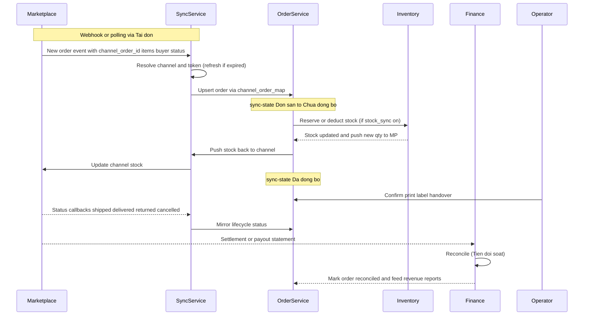

# Marketplaces / Channels — Per-Marketplace Deep Dive

Detailed documentation of the multi-channel sales integration (Kênh bán → Kết nối sàn) on nhanh.vn, captured live (businessId 137541). Complements channels-deep.md with per-marketplace screenshots and field-level structure.

## Channel hub — /ecommerce/manage/setting
Left sidebar lists every channel type with a live connection count:
- **Tất cả (9)** — all connections
- **Shopee (2)**
- **Tiktok (0)**
- **Lazada (0)**
- **Tiki (0)**
- **Facebook Shop (7)**
- Tiếp thị liên kết (affiliate)
- Website
- Chat đa kênh (omni-chat)
- Hóa đơn điện tử (e-invoice)
- Zalo Mini App

**Aggregate grid columns**: Tên gian hàng | Shop ID, Đồng bộ sản phẩm (product-sync mode), Cập nhật tồn kho (stock-sync on/off icon), Đồng bộ đơn hàng (Tự động), Hạn sử dụng (subscription expiry), **Hạn token** (OAuth token expiry + "Gia hạn token" renew button), row-action menu.
A banner warns: "3 cửa hàng, 1 website, 2 kết nối sàn sắp hết hạn".

### Product-sync modes (Đồng bộ sản phẩm)
- **Đợi ghép sản phẩm giữa 2 bên** — wait to map products on both sides (manual match)
- **Luôn lấy sản phẩm từ sàn TMĐT về** — always pull products from the marketplace
- **Đồng bộ tự động từ Nhanh** — push from Nhanh (Facebook)

---

## Shopee — /ecommerce/shopee/setting
Header: "Kết nối gian hàng Shopee sẽ giúp bạn đồng bộ tồn kho, đơn hàng giữa 2 hệ thống...".
Connections (2): **PHANHNGUYEN277** (Shop ID 193915742, mode "Đợi ghép") and **Tiệm San San** (Shop ID 159849315, mode "Luôn lấy sản phẩm từ sàn").
**Columns**: Tên gian hàng|Shop ID, Đồng bộ sản phẩm, Cập nhật tồn kho, Đồng bộ đơn hàng, **Tiền quảng cáo** (ad-spend toggle), Ngày hết hạn. Both tokens are expired (red dates 26/09/2024, 28/02/2024 on the hub).
Sync semantics (footnotes):
- Sản phẩm: pull product info Shopee→Nhanh or push Nhanh→Shopee.
- Tồn kho: push stock Nhanh→Shopee immediately on change.
- Đơn hàng: pull order info + status Shopee→Nhanh to auto-deduct stock, feed revenue reports, mark reconciled.

### Shopee orders — /ecommerce/shopee/order
Two tab layers:
- **Sync-state tabs**: Đơn sàn / Chưa đồng bộ / Đã đồng bộ
- **Lifecycle tabs** (with counts): Tất cả / Chờ xác nhận / Chờ lấy hàng / Đang giao / Đã huỷ / Trả hàng / Xuất kho
Filters: ID, **ID Shopee**, Mã vận đơn HVC (carrier tracking no.), Gian hàng, Trạng thái, Sản phẩm, Khách hàng, Ngày tạo, Hãng vận chuyển, Kho hàng.
Actions: **Tải đơn** (pull orders from Shopee), Thao tác, In đơn. Grid columns: Sản phẩm, Giá bán, Thành tiền, Vận chuyển, Thanh toán.

---

## Lazada — /ecommerce/lazada/setting
Same connection-grid shape as Shopee (Tên gian hàng|Shop ID, Đồng bộ sản phẩm, Cập nhật tồn kho, Đồng bộ đơn hàng, Ngày hết hạn, **Hạn token**). No active connection in this account. Same OAuth-token + sync model.

## Tiki — /ecommerce/tiki/* and Tiktok — /ecommerce/tiktok/*
Present in the sidebar with the same connection model; 0 connections in this account.

---

## Facebook Shop (Meta) — /ecommerce/meta/setting
Structurally **distinct** from marketplaces — maps to Meta Business + Pages rather than shop tokens.
Header benefits: enable Messenger cart (Giỏ hàng trên Messenger), Livestream cart-attach, and purchase-optimized ads.
Connections (7), all under Meta Business **Susi Store (478967388415114)**.
**Columns**: **Meta Business** (name + id), Tên gian hàng|Shop ID, **Page** (linked FB page name + page id), Đồng bộ sản phẩm ("Đồng bộ tự động từ Nhanh"), Cập nhật tồn kho, Đồng bộ đơn hàng (Tự động), **Kiểm tra kết nối** ("Xem trên Meta" link-out).
Sample pages mapped: Đi làm thôi (291748820697369), Study with me (438806669297401), July Florist, Strawberry Cake, Anna Accessories, Maya Shop, Elly Bag — each backed by a "Products for {name}" catalog/shop id.

---

## Data-model implications (for rebuild)
- A `channel` row carries: type (shopee|lazada|tiki|tiktok|meta|website), external shop_id, display name, and — for Meta — a meta_business_id + page_id.
- OAuth credentials per connection: `access_token`, `refresh_token`, `token_expires_at` (drives the "Gia hạn token" UX). Marketplaces expire; Meta uses page tokens.
- Per-connection sync flags: `product_sync_mode` (wait_map | pull_from_channel | push_from_nhanh), `stock_sync` (bool), `order_sync` (auto|manual), `ad_spend_sync` (Shopee only).
- `channel_order` ingestion: a **Pull orders** job (Tải đơn) fetches marketplace orders, maps to internal order via `channel_order_map`, mirrors lifecycle status (Chờ xác nhận→Chờ lấy hàng→Đang giao→Đã huỷ/Trả hàng), and stores a sync-state (Đơn sàn / Chưa đồng bộ / Đã đồng bộ).
- A subscription/expiry concept (Hạn sử dụng) is separate from the OAuth token expiry (Hạn token).

See channels-deep.md for the e-commerce sync workflow narrative and 14-database-schema.md (channel / channel_listing / channel_order_map) for the entities.

---

## Order-sync sequence (Mermaid)

How a marketplace order flows from the channel into Nhanh and back, reconstructed from the Shopee order page (Tai don + sync-state/lifecycle tabs) and the channel sync flags.

### State mapping
| Nhanh sync-state | Meaning |
|---|---|
| Don san | raw order seen on the channel, not yet imported |
| Chua dong bo | imported but product/stock not yet matched |
| Da dong bo | fully mapped, stock deducted, counts toward reports |

| Lifecycle tab | Channel equivalent |
|---|---|
| Cho xac nhan | awaiting seller confirmation |
| Cho lay hang | awaiting carrier pickup |
| Dang giao | in transit |
| Da huy | cancelled |
| Tra hang | return/refund |
| Xuat kho | stock issued / fulfilled |

Reconciliation closes the loop: marketplace settlement statements are matched in **Tien doi soat** (/report/order/verifyandtransfer and /accounting/debts/merchant), after which the order's revenue is recognized.
